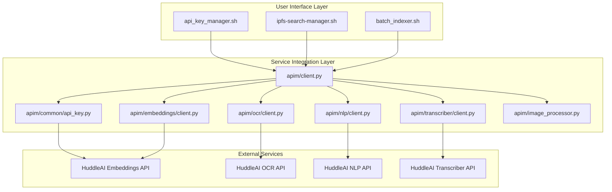
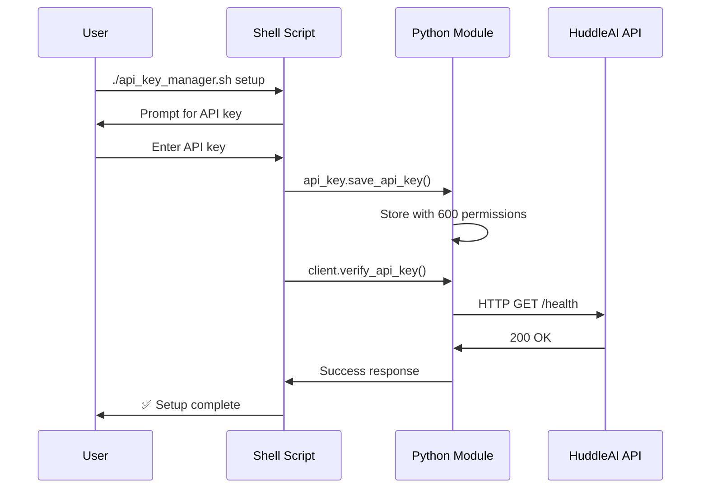

# HuddleAI API Management Architecture Documentation

## 🏗️ **System Overview**

The HuddleAI API Management system implements a **two-tier architecture** that separates user experience from service integration, providing both interactive CLI tools and programmatic API access.



## 🎯 **Architecture Layers**

### **Layer 1: User Interface (Shell Scripts)**
**Purpose**: Interactive CLI tools for end-users and system administrators

| Component | File | Role | Key Features |
|-----------|------|------|--------------|
| **API Key Manager** | `api_key_manager.sh` | Primary API key management CLI | Setup wizard, troubleshooting, verification |
| **IPFS Search Manager** | `ipfs-search-manager.sh` | Content indexing and search | Image processing, text extraction, embedding generation |
| **Batch Indexer** | `batch_indexer.sh` | Bulk content processing | Mass file processing, batch operations |

### **Layer 2: Service Integration (Python Modules)**
**Purpose**: Low-level API operations and service communication

| Component | File | Role | Key Features |
|-----------|------|------|--------------|
| **Unified Client** | `apim/client.py` | Main API orchestrator | Service coordination, unified interface |
| **API Key Core** | `apim/common/api_key.py` | API key operations | Storage, retrieval, verification, HTTP calls |
| **Embeddings Client** | `apim/embeddings/client.py` | Vector embeddings service | Text/image embedding generation |
| **OCR Client** | `apim/ocr/client.py` | Optical Character Recognition | Document text extraction |
| **NLP Client** | `apim/nlp/client.py` | Natural Language Processing | Text analysis, summarization |
| **Transcriber Client** | `apim/transcriber/client.py` | Audio/Video transcription | Speech-to-text conversion |
| **Image Processor** | `apim/image_processor.py` | Computer vision pipeline | Object detection, image enhancement |

## 🔑 **API Key Management System**

### **Two-Tier Design Pattern**

#### **Tier 1: Shell Interface (`api_key_manager.sh`)**
```bash
# User-facing commands
./api_key_manager.sh check        # Status verification
./api_key_manager.sh setup        # Interactive setup
./api_key_manager.sh troubleshoot # Comprehensive diagnostics
./api_key_manager.sh reset        # Key replacement workflow
```

**Features:**
- 🎨 Rich CLI with colors and ASCII art
- 🔍 Multi-service health checking
- 🛠️ Interactive troubleshooting workflows
- 📊 System diagnostics and reporting
- 🔄 Recovery and reset procedures

#### **Tier 2: Python Backend (`apim/common/api_key.py`)**
```python
# Programmatic interface
api_key.get_api_key()              # Retrieve stored key
api_key.save_api_key(key)          # Secure key storage
api_key.verify_api_key(service)    # Service verification
api_key.call_api(service, op)      # Direct API calls
```

**Features:**
- 🔒 Secure file storage (600 permissions)
- 🌐 HTTP request/response handling
- ⚙️ Service endpoint configuration
- 📝 JSON configuration management
- 🔧 Error handling and logging

### **Integration Flow**



## 📁 **File System Architecture**

### **Configuration Storage**
```
~/.ipfs/
├── huddleai_api_key          # API key (600 permissions)
├── apim_config.json          # Service configuration
└── embeddings/               # Vector storage
    ├── {hash1}.json
    ├── {hash2}.json
    └── ...
```

### **Code Organization**
```
huddle-node-manager/
├── api_key_manager.sh        # CLI management tool
├── ipfs-search-manager.sh    # Content processing
├── batch_indexer.sh          # Bulk operations
└── api/
    └── apim/
        ├── client.py         # Unified client
        ├── common/
        │   └── api_key.py    # Core API operations
        ├── embeddings/
        │   └── client.py     # Embeddings service
        ├── ocr/
        │   └── client.py     # OCR service
        ├── nlp/
        │   └── client.py     # NLP service
        ├── transcriber/
        │   └── client.py     # Transcription service
        └── image_processor.py # Computer vision
```

## 🔧 **Service Configuration**

### **Default API Endpoints**
```json
{
  "base_url": "https://huddleai-apim.azure-api.net",
  "services": {
    "embeddings": {
      "path": "/embedding",
      "health_endpoint": "/v1",
      "operations": {
        "embed": "/v1/api/embed",
        "embed_batch": "/v1/api/embed-batch",
        "models": "/v1/api/models"
      }
    },
    "ocr": {
      "path": "/hocr",
      "health_endpoint": "/v2",
      "operations": {
        "process": "/v2/api/process",
        "status": "/v2/api/status"
      }
    },
    "nlp": {
      "path": "/nlp",
      "health_endpoint": "/v1",
      "operations": {
        "analyze": "/v1/api/analyze",
        "summarize": "/v1/api/summarize"
      }
    },
    "transcriber": {
      "path": "/parsing",
      "health_endpoint": "/v1/healthz",
      "operations": {
        "transcribe": "/v1/api/transcribe",
        "extract_audio": "/v1/api/extract-audio"
      }
    }
  }
}
```

## 🚀 **Usage Patterns**

### **Developer Integration**
```python
# Python code integration
from apim.client import client

# Verify API access
success, message = client.verify_api_key("embeddings")

# Generate embeddings
embeddings_client = client.embeddings
result = embeddings_client.embed_text("Hello world")

# Process images
image_processor = client.image_processor
enhanced_image = image_processor.enhance_image(image_path)
```

### **Shell Script Integration**
```bash
# Shell script integration
source api_key_manager.sh

# Check API key availability
if ! check_api_key; then
    echo "Please run: ./api_key_manager.sh setup"
    exit 1
fi

# Verify specific service
if verify_service "embeddings"; then
    echo "Embeddings service available"
fi
```

### **End-User Workflows**
```bash
# Initial setup
./api_key_manager.sh setup

# Daily usage
./ipfs-search-manager.sh search "document.pdf"
./batch_indexer.sh process_directory "~/Documents"

# Troubleshooting
./api_key_manager.sh troubleshoot
```

## 🔍 **Service Verification Matrix**

| Service | Health Check | Status | Features |
|---------|-------------|--------|----------|
| **Embeddings** | ✅ Working | Available | Text/image vectorization |
| **OCR** | ✅ Working | Available | Document text extraction |
| **NLP** | ❌ Connection Issues | Partial | Text analysis (endpoint issues) |
| **Transcriber** | ❌ Connection Issues | Partial | Audio processing (endpoint issues) |

## 🛠️ **Error Handling Strategy**

### **Graceful Degradation**
1. **Primary Method**: Use new API key manager
2. **Fallback Method**: Legacy API key handling
3. **Error Recovery**: Interactive troubleshooting
4. **User Guidance**: Clear error messages and solutions

### **Common Error Scenarios**
| Error Type | Detection | Resolution |
|------------|-----------|------------|
| **Missing API Key** | File not found | Interactive setup wizard |
| **Invalid API Key** | 401 Unauthorized | Key reset workflow |
| **Network Issues** | Connection timeout | Network diagnostics |
| **Service Unavailable** | 404/503 errors | Service status reporting |
| **Permission Issues** | File access denied | Permission repair |

## 📊 **Performance Characteristics**

### **Response Times** (Typical)
- **API Key Verification**: 1-3 seconds
- **Embeddings Generation**: 2-5 seconds
- **OCR Processing**: 5-15 seconds
- **Image Enhancement**: 3-8 seconds

### **Scalability Limits**
- **Concurrent Requests**: Limited by API rate limits
- **File Size Limits**: Varies by service (typically 10-50MB)
- **Batch Processing**: Configurable batch sizes

## 🔮 **Future Enhancements**

### **Planned Features**
- [ ] **Multi-tenant Support**: Multiple API key profiles
- [ ] **Caching Layer**: Local result caching
- [ ] **Load Balancing**: Multiple endpoint support
- [ ] **Monitoring Dashboard**: Service health visualization
- [ ] **Auto-retry Logic**: Intelligent failure recovery

### **Extension Points**
- **New Services**: Add to `apim/` directory
- **Custom Processors**: Extend image processing pipeline
- **Storage Backends**: Alternative to IPFS
- **Authentication Methods**: OAuth, JWT support

## 📚 **References**

### **Key Files**
- [`api_key_manager.sh`](./api_key_manager.sh) - Main CLI tool
- [`api/apim/common/api_key.py`](./api/apim/common/api_key.py) - Core API module
- [`api/apim/client.py`](./api/apim/client.py) - Unified client interface

### **Configuration Files**
- `~/.ipfs/huddleai_api_key` - API key storage
- `~/.ipfs/apim_config.json` - Service configuration
- `~/.ipfs/embeddings/` - Vector embeddings cache

### **External Dependencies**
- **Python**: requests, pathlib, json, logging
- **Shell**: bash, curl, jq, python3
- **System**: IPFS daemon, file permissions

---

## 📝 **Version History**

| Version | Date | Changes |
|---------|------|---------|
| **1.0** | 2025-01-21 | Initial two-tier architecture |
| **1.1** | 2025-01-21 | Enhanced troubleshooting and error handling |

---

*This document serves as the definitive reference for the HuddleAI API Management architecture. Keep it updated as the system evolves.* 