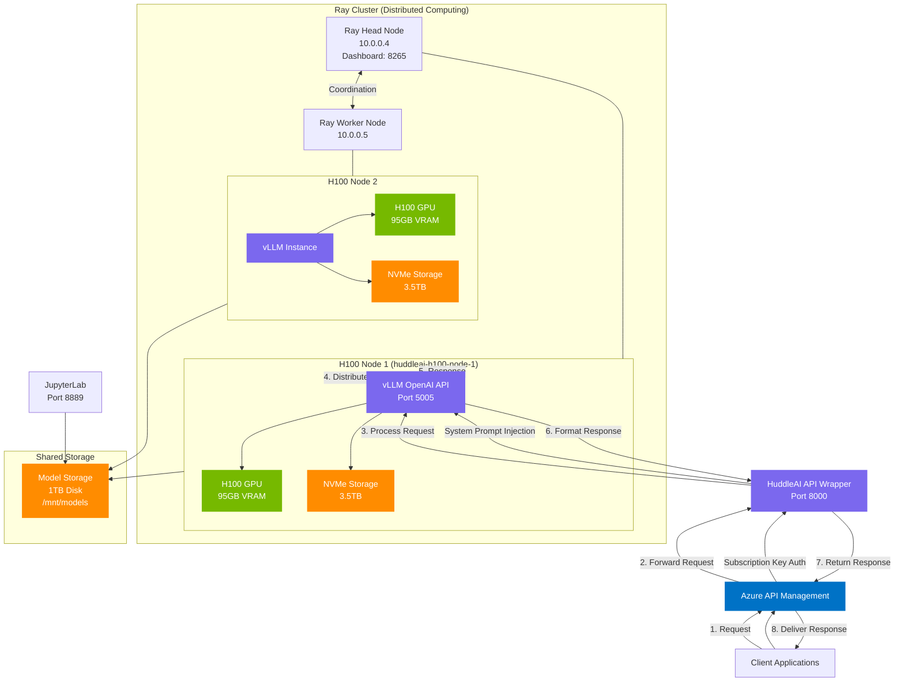

# H100 GPU Inference Architecture Flowchart

## Architecture Components

### Client Layer
- **Client Applications**: Desktop apps, web interfaces, and API consumers
- **Azure API Management**: Handles rate limiting, subscription management, and authentication

### API Layer
- **HuddleAI API Wrapper**: Custom service that adds system prompts and manages request formatting
- **vLLM OpenAI API**: Provides OpenAI-compatible endpoints for LLM inference

### Compute Layer
- **Ray Cluster**: Distributed computing framework managing resources across nodes
  - **Head Node (10.0.0.4)**: Coordinates the cluster and runs inference
  - **Worker Node (10.0.0.5)**: Provides additional compute resources
- **H100 GPUs**: High-performance compute for model inference (95GB VRAM each)
- **NVMe Storage**: Fast local storage for inference caching and temporary files

### Storage Layer
- **Shared Model Storage**: 1TB disk mounted at `/mnt/models` across all nodes
- **Symbolic Links**: Efficient model file sharing between different paths

### Development Layer
- **JupyterLab**: Development environment with direct access to model files

## Data Flow Sequence

1. Client sends request to Azure API Management
2. APIM authenticates via subscription key and forwards to HuddleAI API
3. HuddleAI API adds system prompts and formats the request
4. Request is sent to vLLM OpenAI-compatible API
5. vLLM distributes inference across the Ray cluster
6. Ray coordinates tensor parallelism across H100 GPUs
7. Results are returned to vLLM and formatted
8. Response flows back through the API layers to the client

## Optimization Features

- **Tensor Parallelism**: Models distributed across multiple GPUs
- **Fast Storage**: NVMe drives for caching and temporary storage
- **Shared Models**: Symbolic links for efficient model sharing
- **Memory Optimization**: 90% GPU memory utilization setting
- **Network Optimization**: NCCL environment variables for efficient GPU communication 